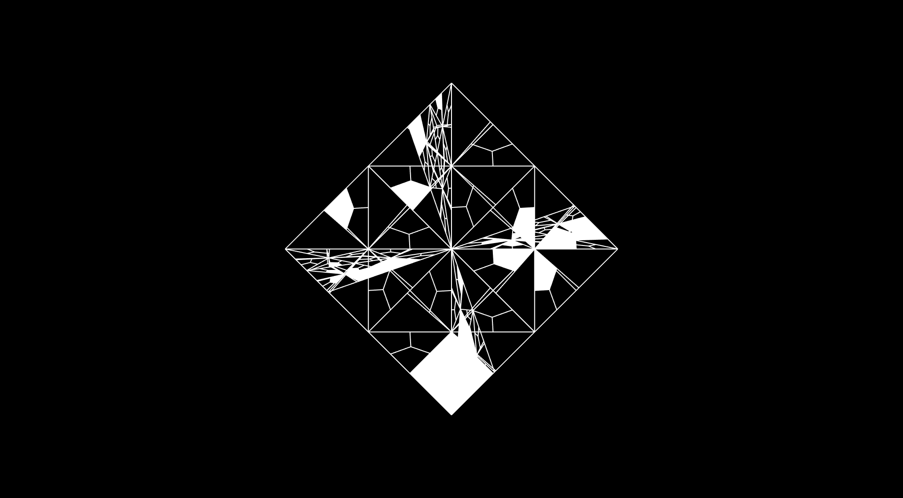

# Simon Dietz
Interdisziplinärer Entwickler & Kreativtechniker

# Portfolio / Projekte

## Mesh Modifikatoren  

Im Laufe der Jahre habe ich eine Vielzahl an Mesh-Modifikatoren implementiert. Diese ermöglichen es, Grundformen durch gezielte Transformationen zu verändern und zu komplexen, oft unerwarteten Strukturen weiterzuentwickeln.  

Durch die Kombination verschiedener Modifikatoren entsteht eine nahezu unendliche Vielfalt an Formen. Die spielerische Aneinanderreihung und Variation der einzelnen Operationen erlaubt es, neue Formwelten zu erkunden, ohne dabei händisch modellieren zu müssen. Dieser experimentelle Ansatz macht es möglich, kreative und algorithmisch generierte Geometrien zu erschaffen.  

### Modifikator-Sequenz  

Das folgende Beispiel zeigt einen möglichen Ablauf der Formgenerierung anhand einer Sequenz von Modifikatoren:  

1. **Icosahedron** als Ausgangsform  
2. **Bevel Vertices** (Abrunden der Ecken)  
3. **Tessellierung der Flächen** durch Planar Vertex Center  
4. **Weitere Tessellierung** mittels MidEdge Center  
5. **Spherify** zur Annäherung an eine Kugelform  
6. **Holes Modifier** für Durchbrüche in der Geometrie  
7. **Solidify** zur Verdickung der Struktur  


### Code-Beispiel zur Transformation  

```java
public void createMesh() {
    mesh = new IcosahedronCreator().create();
    new BevelVerticesModifier(0.2f).modify(mesh);
    new PlanarVertexCenterModifier().modify(mesh);
    new PlanarMidEdgeCenterModifier().modify(mesh);
    new SpherifyModifier().modify(mesh);
    new HolesModifier(0.8f).modify(mesh);
    new SolidifyModifier(0.02f).modify(mesh);
    new ScaleModifier(350).modify(mesh);
}
```

## HeroQuest Fan Art – Eine Hommage an klassische Fantasy-Illustrationen

Anfang der 90er Jahre – es muss etwa 1992 gewesen sein – wurde ich durch einen Freund auf das Spiel HeroQuest aufmerksam. Schon damals faszinierte mich die Welt dieses Klassikers, insbesondere die Old-School-Fantasy-Illustrationen der Spielkarten. Die düsteren, detailreichen Zeichnungen weckten meine Begeisterung für visuelles Storytelling und die Ästhetik klassischer Fantasy-Kunst.

Viele Jahre später, vermutlich Anfang der 2010er Jahre (2014), begann ich damit, eigene Kartenillustrationen anzufertigen – in einer Zeit, in der künstliche Intelligenz noch keine Rolle in der kreativen Gestaltung spielte. Jedes Motiv entstand in Handarbeit, inspiriert von den ikonischen Werken, die mich einst in meiner Kindheit in ihren Bann zogen.


## Retro Game Jam – Eine Hommage an die Gameboy-Ära

Als Kind der 80er und 90er, aufgewachsen mit dem Game Boy, schlummert in mir eine tiefe Leidenschaft für die Ästhetik von 8-Bit- und 16-Bit-Grafiken. Die pixelige, reduzierte Optik dieser Ära hat für mich bis heute einen besonderen Charme.

Im Rahmen eines persönlichen Game Jams entstand eine einfache, aber stilvolle Umsetzung des Spieleklassikers Snake – natürlich in authentischer Game Boy-Optik. Ein besonderes Detail war der ikonische Fade-Effekt, den man beispielsweise aus Quirk kennt – übrigens eines meiner All-Time-Favorites.

Das Projekt war bewusst minimalistisch gehalten und konzentrierte sich auf die Erstellung eines klassischen Spritesheets sowie die korrekte Skalierung mithilfe des Nearest-Neighbor-Algorithmus. Ziel war es, die Retro-Ästhetik so originalgetreu wie möglich einzufangen und eine kleine, aber liebevolle Hommage an die Spiele meiner Kindheit zu schaffen.

](https://www.youtube.com/watch?v=CspzAxke_QY)

## NBT-Bibliothek

Diese Bibliothek bietet Funktionen zum Lesen, Schreiben und Validieren von Named Binary Tag (NBT)-Dateien, die in Minecraft zur Datenspeicherung verwendet werden. Sie unterstützt das Lesen und Schreiben von komprimierten (Gzip) NBT-Dateien sowie das Erstellen von Schematic-Dateien (*.schematic).

**Hintergrund & Intention**

Die NBT-Bibliothek entstand als Nebenprojekt im Rahmen eines größeren Minecraft-Projekts. Im Jahr 2021 wurde ich von einem Bauteam gebeten, ein Tool zu entwickeln, das große 3D-Modelle (im OBJ-Format) aus Blender direkt in Minecraft-Welten importieren kann.

Zuvor hatte das Team versucht, diesen Prozess mit dem Online-Voxelizer von Drububu zu automatisieren. Obwohl dieses Tool die Möglichkeit bietet, Voxel-Daten als Minecraft-Schematics zu exportieren, stößt es bei großen Modellen an Grenzen. Einschränkungen hinsichtlich maximaler Größe und Blockanzahl erforderten es, große Modelle in kleinere Teile aufzuteilen und sie einzeln in Minecraft zu integrieren – ein zeitaufwändiger Prozess.

Um dieses Problem zu lösen, entwickelte ich ein Tool, das OBJ-Modelle direkt in Minecraft-Welten überträgt. Dazu war es notwendig, die Daten in das NBT-Format zu konvertieren, das Minecraft zur Speicherung von Weltdaten verwendet. Die Entwicklung dieses Tools führte schließlich zur Entstehung der NBT-Bibliothek.

[NBT on Github](https://github.com/ArtifactForms/nbt)



### Chatbot Project

A simple chat bot.

If you are interested in learning more about chatbots and following the progress of my project, including my learning journey, please feel free to consult my project documentation. It will be updated regularly throughout the project.

[ChatBot Project Documentation](https://artifactforms.github.io/ChatBot/documentation/project.html)

### Artifact Forms

A Personal 3D Project - Explore the world of 3D geometry with this open-source Java library, built as a learning project.

**Background / Intension**

This Java library began as a hobby project in 2015/2016. I started it to deepen my understanding of creating and manipulating 3D geometry. This built upon knowledge I gained from an earlier internship with product design students. During that time, I was introduced to the programming language Processing.

Processing captivated me from the start. Designed for visual learners, Processing is a great tool to get started with programming. You can learn more at processing.org. While Processing isn't strictly necessary, the library's core functionality is independent of the Processing environment. However, Processing offers a convenient way to visualize constructed meshes through its rendering pipeline, which leverages JAVA, JAVA2D, and OPENGL.

[MeshLib on Github](https://github.com/ArtifactForms/MeshLibCore)

### Nbt Library

This library provides functionalities for reading, writing, and validating Named Binary Tag (NBT) files used for data storage in Minecraft. It supports reading and writing compressed (gzip) NBT files and writing schematic files (.schematic).

**Background / Intension**

The NBT library originated as a side project during a larger Minecraft project. In 2021, I was asked by a building team to develop a tool that could import large 3D models (in OBJ format) from Blender directly into Minecraft worlds.

Previously, the team had tried to automate this process using the online Voxelizer from Drububu. While this tool offers the ability to export voxel data into Minecraft Schematics, it encounters limitations when dealing with large models. The restrictions regarding maximum size and block count made it necessary to split large models into smaller parts and individually integrate them into Minecraft - a time-consuming process.

To solve this problem, I developed a tool that transfers OBJ models directly into Minecraft worlds. To do this, it was necessary to convert the data into the NBT format, which Minecraft uses to store world data. The development of this tool led to the creation of the NBT library.

[NBT on Github](https://github.com/ArtifactForms/nbt)

## Languages & Tools
<p align="left">
  
  
  
  
  
  
  
  
  
  
</p>
